# Hi, I'm Chander Bhanu 👋

### MSc Web & Data Science
**Data Science · Machine Learning · Data Engineering · AI Engineering**

I build end-to-end systems where **data, machine learning, and modern AI** meet.
From pipelines and explainable models to **LLM agents, retrieval, evaluation, and production workflows**.

[GitHub](https://github.com/chanderbhanu096) · [LinkedIn](https://www.linkedin.com/in/chanderbhanu/)

---

## 🌙 What I'm working on

| AI engineering | Data + ML foundation |
|---|---|
| AI agents and agentic workflows | Data engineering pipelines |
| LLMs, RAG, retrieval and embeddings | Applied machine learning |
| MCP and tool calling | Model explainability |
| Text-to-SQL and natural-language data interfaces | PySpark and Airflow |
| LLM evaluation, guardrails and verification | Analytics and decision systems |
| Tracing, memory, context and model routing | Azure data platforms |
| Production AI and MLOps | Reproducible ML workflows |

I like understanding what happens **under the hood**, building the important parts from first principles when it helps, and then making the system reliable enough to measure and use.

---

## 🛠 Stack

**AI**  
`LLMs` · `AI Agents` · `RAG` · `MCP` · `Tool Calling` · `Text-to-SQL` · `Embeddings` · `Evaluation` · `Guardrails`

**Data & ML**  
`Python` · `SQL` · `PySpark` · `Airflow` · `Machine Learning` · `XGBoost` · `PyTorch` · `SHAP` · `Tableau`

**Platform & Engineering**  
`Azure` · `Docker` · `Terraform` · `GitHub Actions` · `Git` · `Linux` · `FastAPI`

---

## ☕ Currently building

| Project | What it explores |
|---|---|
| **[Data Agent From Scratch](https://github.com/chanderbhanu096/data-agent-from-scratch)** | Building a text-to-SQL agent from the loop up: tool calling, retrieval, verification, memory, evaluation, tracing and MCP. |
| **[ForgeOps](https://github.com/chanderbhanu096/forgeops)** | Evidence-first AI for repository investigation, with explicit approvals and verification around model-driven work. |
| **[ResearchFlow](https://github.com/chanderbhanu096/research-flow)** | Agentic research workflows with retrieval, evidence checks, human approval, analytics and production-minded architecture. |

---

## 📚 Selected data & ML work

| Project | Focus |
|---|---|
| **[RewardLens](https://github.com/chanderbhanu096/rewardlens-fraud-decision-lab)** | Post-install fraud analytics, anomaly detection, thresholds and decision science. |
| **[NYC Taxi Data Engineering & ML Pipeline](https://github.com/chanderbhanu096/nyc-taxi-ml-pipeline)** | PySpark, Airflow, Azure and end-to-end ML pipeline engineering. |
| **[Seoul Bike Sharing Demand](https://github.com/chanderbhanu096/Seoul-Bike-Sharing-Demand)** | Forecasting with XGBoost, SHAP explainability and Tableau. |
| **[Sentiment Analysis with Deep Learning](https://github.com/chanderbhanu096/sentiment-analysis-nlp)** | NLP with PyTorch, CNNs and LSTMs. |

---

## 🐍 Late-night contributions

  

---

`late nights · clean systems · curious mind`

