# Hi, I'm Chander Bhanu 👋

### MSc Web & Data Science
**Data Science · Machine Learning · Data Engineering · AI Engineering**

I build end-to-end systems where **data, machine learning, and modern AI** meet.  
From pipelines and explainable models to **LLM agents, retrieval, evaluation, and production workflows**.

[GitHub](https://github.com/chanderbhanu096) · [LinkedIn](https://www.linkedin.com/in/chanderbhanu/)

 

---

## 🌙 What I build

- **AI systems:** agents, RAG, embeddings, tool calling, MCP, Text-to-SQL and context-aware workflows
- **Reliable LLM workflows:** evaluation, guardrails, verification, tracing, memory and model routing
- **Data + ML systems:** pipelines, analytics, applied machine learning and model explainability
- **Production engineering:** Azure, Docker, Terraform, CI/CD, MLOps and observable services

I like understanding what happens **under the hood**, building the important parts from first principles when it helps, and then making the system reliable enough to measure and use.

---

## ⚡ Tech after dark

 

**AI & Agentic Systems**  
`LLMs` · `AI Agents` · `RAG` · `MCP` · `Tool Calling` · `Text-to-SQL` · `Embeddings` · `Evaluation` · `Guardrails`

**Data & Machine Learning**  
`Python` · `SQL` · `PySpark` · `Airflow` · `Machine Learning` · `XGBoost` · `PyTorch` · `SHAP` · `Tableau`

**Platform & Engineering**  
`Azure` · `Docker` · `Terraform` · `GitHub Actions` · `FastAPI` · `Git` · `Linux`

---

## ☕ Currently building

<table>
<tr>
<td width="33%" valign="top">

### 🤖 [Data Agent From Scratch](https://github.com/chanderbhanu096/data-agent-from-scratch)

A text-to-SQL agent built from the loop up.

`Agents` `Tool Calling` `Retrieval` `Evaluation` `Tracing` `MCP`

</td>
<td width="33%" valign="top">

### 🔎 [ForgeOps](https://github.com/chanderbhanu096/forgeops)

Evidence-first AI for repository investigation and controlled model-driven work.

`Agents` `Verification` `GitHub` `FastAPI` `Next.js`

</td>
<td width="33%" valign="top">

### 🧠 [ResearchFlow](https://github.com/chanderbhanu096/research-flow)

Agentic research workflows with retrieval, evidence checks and human approval.

`RAG` `LangGraph` `Evaluation` `Analytics` `Azure`

</td>
</tr>
</table>

---

## 📚 Selected data & ML work

<table>
<tr>
<td width="50%" valign="top">

### ⚖️ [RewardLens](https://github.com/chanderbhanu096/rewardlens-fraud-decision-lab)
Post-install fraud analytics, anomaly detection, thresholds and decision science.

</td>
<td width="50%" valign="top">

### 🚕 [NYC Taxi ML Pipeline](https://github.com/chanderbhanu096/nyc-taxi-ml-pipeline)
PySpark, Airflow, Azure and end-to-end ML pipeline engineering.

</td>
</tr>
<tr>
<td width="50%" valign="top">

### 🚲 [Seoul Bike Sharing Demand](https://github.com/chanderbhanu096/Seoul-Bike-Sharing-Demand)
Forecasting with XGBoost, SHAP explainability and Tableau.

</td>
<td width="50%" valign="top">

### 💬 [Sentiment Analysis with Deep Learning](https://github.com/chanderbhanu096/sentiment-analysis-nlp)
NLP with PyTorch, CNNs and LSTMs.

</td>
</tr>
</table>

---

## 🐍 Late-night contributions

  

---

`late nights · curious systems · build from first principles · ship what works`

